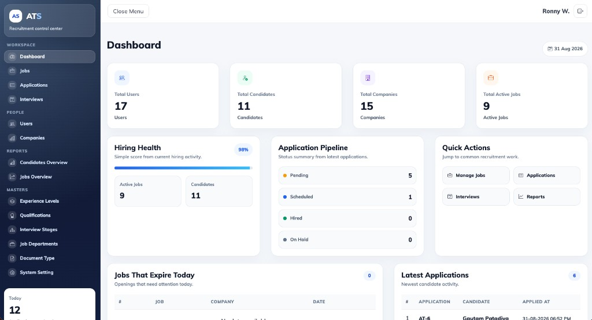
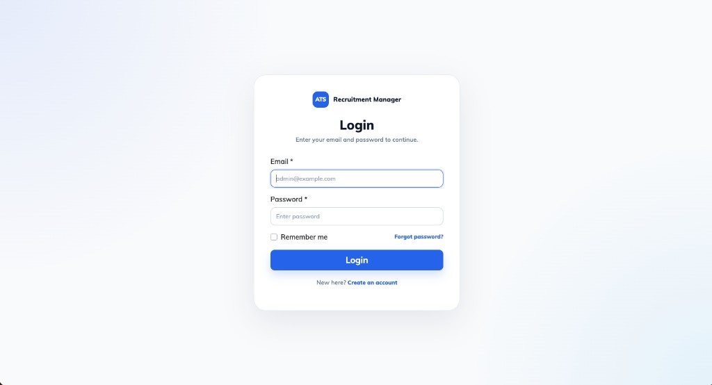
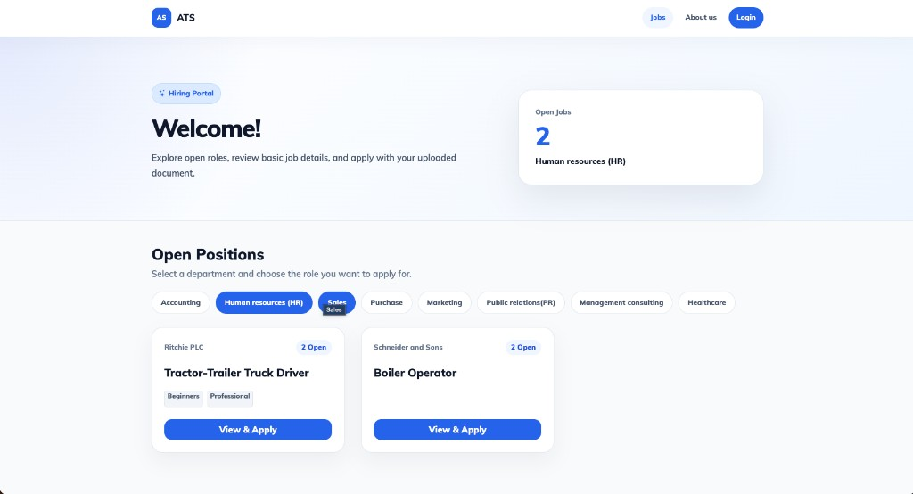

## S1 Recruitment System Manager

S1 Recruitment System Manager is a simple applicant tracking system for HR teams, recruiters, and consulting companies.

It helps manage companies, jobs, candidates, applications, interviews, reports, uploaded documents, and basic system settings.

The project has two parts:

- Laravel 11 backend API
- Vue 2 frontend single-page app

Authentication uses Laravel Sanctum API bearer tokens.

## Main Features

- Public job listing page
- Candidate registration and login
- Candidate profile with document upload
- Candidate applied jobs section
- Job application flow from public jobs
- Admin dashboard with charts and activity widgets
- Company management
- User and candidate management
- Job management
- Job application management
- Interview management with interview stages and statuses
- Reports for candidates and jobs
- Master setup modules:
  - Experience Levels
  - Qualifications
  - Interview Stages
  - Job Departments
  - Document Types
- System settings for app name, URL, logo text, home page title, application prefix, about page content, and email verification behavior
- CSV and PDF export in admin modules
- Clean BootstrapVue based admin UI
- `vue-select` for select boxes
- `vue2-datepicker` for date and date-time fields
- Highcharts dashboard charts

## Requirements

Backend:

- PHP 8.2 or higher
- Composer
- MySQL
- Common Laravel extensions such as OpenSSL, PDO, Mbstring, Tokenizer, XML, Ctype, JSON, and BCMath

Frontend:

- Node.js 20, 21, or 22
- npm 10 or higher

The frontend package is configured with:

```json
"engines": {
  "node": ">=20 <23",
  "npm": ">=10"
}
```

## Backend Setup

Install PHP dependencies from the project root:

```bash
composer install
```

Create the backend environment file:

```bash
cp .env.example .env
```

Generate the Laravel app key:

```bash
php artisan key:generate
```

Update these values in `.env`:

```dotenv
APP_NAME=ATS
APP_ENV=local
APP_DEBUG=true
APP_URL=http://localhost:8000
FRONT_APP_URL=http://localhost:8080/

DB_CONNECTION=mysql
DB_HOST=127.0.0.1
DB_PORT=3306
DB_DATABASE=your_database_name
DB_USERNAME=your_database_user
DB_PASSWORD=your_database_password
```

Run migrations and seed data:

```bash
php artisan migrate --seed
```

Create the storage symlink:

```bash
php artisan storage:link
```

Make sure Laravel can write to these folders:

```bash
chmod -R 775 storage bootstrap/cache
```

## Frontend Setup

Go to the frontend folder:

```bash
cd front
```

Create the frontend environment file:

```bash
cp .env.example .env
```

For local development, the frontend `.env` usually looks like this:

```dotenv
VUE_APP_API_URL=http://localhost:8000
VUE_APP_DEV_SERVER_HOST=localhost
VUE_APP_DEV_SERVER_PORT=8080
```

Install frontend dependencies:

```bash
npm install
```

## Run Locally

Start the Laravel backend from the project root:

```bash
php artisan serve
```

Backend URL:

```text
http://localhost:8000
```

Start the Vue frontend in another terminal:

```bash
cd front
npm run serve
```

Frontend URL:

```text
http://localhost:8080
```

If you changed `VUE_APP_DEV_SERVER_PORT`, use that port instead.
## Default Login

After running seeders, use this admin account:

```text
Email: admin@admin.com
Password: password
```

## Authentication Notes

This project uses Laravel Sanctum API bearer tokens.

Passport is not used anymore.

The frontend stores the authenticated user and token in browser storage and sends the token with API requests.

## Settings Files

Runtime app settings are stored in:

```text
public/settings.json
front/public/settings.json
```

Important settings:

- `app_name` controls the app name
- `app_url` controls the API base URL fallback
- `text_logo_part_one` and `text_logo_part_two` control logo text
- `home_page_title` controls the public jobs page title
- `job_application_number_prefix` controls generated application numbers
- `user_has_to_verify_email_after_register` controls candidate email verification

## Email Setup

Email is used for:

- Candidate email verification
- Forgot password
- Reset password

Update mail settings in `.env`:

```dotenv
MAIL_MAILER=smtp
MAIL_HOST=smtp.mailtrap.io
MAIL_PORT=2525
MAIL_USERNAME=null
MAIL_PASSWORD=null
MAIL_FROM_ADDRESS=hello@example.com
MAIL_FROM_NAME="${APP_NAME}"
```

## Production Build

Build the frontend:

```bash
cd front
npm run build
```

The build command writes compiled frontend assets into Laravel `public/`.

For production, point the web server document root to:

```text
public/
```

## Helpful Commands

Clear Laravel cache:

```bash
php artisan optimize:clear
```

Run backend tests:

```bash
php artisan test
```

Optional local asset helper:

```bash
php artisan ats:make-symbolic-link
```

## Troubleshooting

If the frontend still calls `http://localhost:8000`:

- Check `front/.env`
- Make sure `VUE_APP_API_URL` is correct
- Restart `npm run serve` after changing `.env`
- Check `front/public/settings.json` because it is used as a fallback

If registration or forgot password fails:

- Check backend logs in `storage/logs/laravel.log`
- Confirm mail settings are correct
- Confirm `APP_URL` and `FRONT_APP_URL` are correct

If uploaded files are not opening:

```bash
php artisan storage:link
```

If frontend install fails because of Node:

- Use Node.js 20, 21, or 22
- Use npm 10 or higher
- Run `npm install` inside the `front` folder

## License

This project is open-source under the MIT license.

## Screenshots

### Admin Dashboard



### Login



### Public Jobs Page


